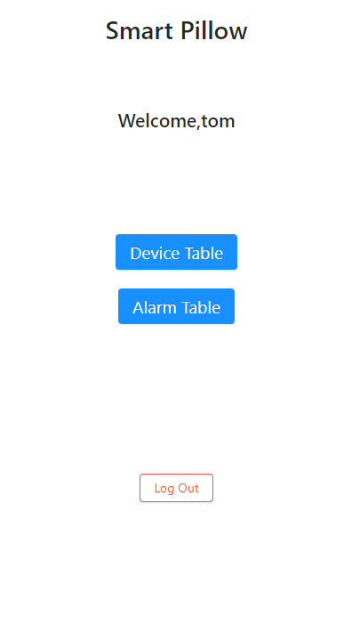

教育部高等学校大学计算机课程教学指导委员会

中国大学生计算机设计大赛

软件开发类作品文档简要要求

作品编号：		

作品名称：		智能枕芯						

版本编号：		V 1.1						

填写日期：		2020.5.22					

# 第一章 需求分析

## 1.1 产品开发背景

智能家居主要指的是在智能家居控制系统当中对网络安全通信技术、自动控制技术与计算机网络技术进行充分的使用，让家居设备具有一定的智能特点，使用人员可以通过便携式设备，比如说手机对家居设备进行直接控制，比如说，通过无线终端设备、互联网等对家庭设备进行直接控制或者根据一定的场景需要来进行智能启动，另外家庭内部的设备可以进行相互通讯，并且配合操作，这样能够让家居设备更好的为人民服务，让人们的获得一个更安全、更舒适、更便利的生活环境。

下图为智能家居主要产品市场占比

伴随当前物质水平进一步提高，智能家居会逐步广泛应用于人们日常生活中，为人们的生活提供一定的便利，让人们的生活质量得到进一步提高。而智能枕芯作为一个通过物联网技术，与其它智能家居进行互联互通的设备。能够家居设备更好的为用户服务。所以，其它各种智能家居，例如市场中占据大份额的智能空调，智能照明等产品，的发展也会为智能枕芯带来巨大的机遇。

## 1.2 产品的特色分析 

智能枕芯是一个通过物联网技术，与其它智能家居互联互通的嵌入式设备。旨在利用最小的成本，最大化地提升用户生活水平与生活便利程度。我们作品的特色有如下几点：

一 高性价比

相比市场上价格上百的各种产品，我们的成本更加低廉，却可以有多的功能。

由于所有部件都是零售购买，成本会比厂家大量生产高很多。我们的成本如下：stm32c8t6最小系统板8.6元，如果是芯片的话只需要5.15元（淘宝价），esp8266-01S淘宝价5.8元，薄膜压敏传感器49元，传感器配套模块14.8元，震动以及蜂鸣器合计5元，锂电池6.4元，其余杂项硬件材料费用3元，合计92.6元。如果能够大量生产的话，通过更换传感器以及定制PCB，预计成本可以到40元。

二 作为附件

虽然如今市场上已经有了很多智能枕头产品，但是它们的功能大多都是辅助分析睡眠状态，而没有帮助将人唤醒的功能。此外市面上的智能枕头大多都为整个枕头形式的成品，价格较贵，且不能制定。而我们打算做的智能枕芯只是作为枕头的一个附件，垫在枕头下面就可以让普通枕头智能化。而且用户可以自己选择自己喜欢的枕头，附加上我们的产品，就能达到市面上智能枕头的效果，相当于每个用户都能自定义属于自己的智能枕头，对用户有更大的吸引力。

三 互联互通

它通过单片机将各种传感器收集到的数据，通过WIFI模块与云端服务器交互，并结合用户在网站上设置的各种信息，做出提升用户生活便利程度的决策，例如在用户睡觉的时候，自动关闭房间中的灯。此外，我们还在做了硬件上做了离线处理机制，确保了在一段时间内断网的情况下，任然可以正常工作。

四 智能闹钟

市面上现有的智能枕头大多都将目标放在改善用户睡眠情况上，而忽视了一些别的适合集成在智能枕头上的功能，比如智能闹钟。而我们做的智能枕头则添加了这一功能。它能获取用户在网页上设置的闹钟信息，并且在用户该起床的时候智能做出反应。比如，如果用户已经起床了，闹钟就会自动关闭，如果用户一直不起床，闹钟就不会停止，防止睡过。

## 1.3 产品竞品分析 

相比市场上已有的各种智能枕头，我们已经添加了智能闹钟和控制其它智能家电的功能。相比同样有着智能闹钟和控制其它智能家电功能语音助手(比如天猫精灵)，我们的设备更适合被放在卧室，因为它能监测睡眠状态，让闹钟更加智能。此外，我们的设备不会采集语音信息，对保护用户的隐私更友好。并且，我们的硬件成本是所有产品里面最低的。

|          | 睡眠状态监测 | 按摩功能 | 智能闹钟 | 控制其它 智能家居 | 价格      |
|----------|--------------|----------|----------|-------------------|-----------|
| 语音助手 | X            | X        | √        | √                 | 100\~500  |
| 智能枕头 | √            | √        | X        | X                 | 300\~1800 |
| 智能枕芯 | √            | X        | √        | √                 | 40\~100   |

# 第二章 概要设计

## 2.1系统功能设计

我们的智能枕芯及其在云服务器上的相关程序提供了如下功能：

1.  用户可以注册登录账户。由于智能枕芯十分适合与其他的智能家居协同工作，比如小米，华为等提供的智能设备，登录的最佳方案是与第三方的账号绑定。但由于我们并没有相关的授权，所以登录与注册仅仅作为代替方案使用。

2.  管理设备，包括购买硬件之后根据指导添加设备到自己的账户，修改设备的名字方便记忆，与删除不用的设备。

3.  设置闹钟，通过闹钟设置的睡眠时间段，对同一用户的所有智能设备进行控制。比如在用户应该起床的时候，自动响铃，而在确保用户已经起床，或者是已经提前起床的情况下，自动关闭闹钟。这一点是目前其它智能家居很少做到的。此外，在用户晚上起床的时候，自动打开走廊上的灯，或者是在用户睡觉的时候，帮助用户进行自动关灯，解决了关灯后看不清的麻烦。

**图2-1 系统功能设计图**

## 2.2系统架构设计

我们系统架构一共分为7个层次，分别是
前端UI，展示层，业务层，数据层，数据库，运行环境与设备模块。

前端UI，展示层由前端发服务器来提供服务，主要是提供能够被用户访问的网页，并且将用户的操作传递给后端服务器。

业务层，数据层，数据库由后端服务器负责提供服务。业务层包括和前端服务器协作通讯完成用户管理，设备管理与闹钟管理，并且对数据库进行相应的读写操作。业务层还包括完成于硬件设备的通讯，接收硬件发送的数据，并且在做出预测之后将预测结果和用户在网站上的设置推送到硬件设备，以此完成智能的互联互通。同时后端服务器也包括对用户权限的控制与对必要过程的日志记录。

运行环境与设备模块则代表了系统功能与硬件的对应关系。其中前端服务器与后端服务器上的功能都是云服务器提供服务，确保能够24小时在线工作。而嵌入式设备则是我们的智能枕芯，设备模块着对应着智能枕芯在硬件上的组成。

整个系统的架构设计如如2-2所示。

**图2-2 系统架构设计图**

## 2.3物理架构设计

为了最大化的方便用户使用，比如在手机，笔记本和台式电脑上都可以轻松地访问我们的设置界面，我们通过前端服务器提供了通过web界面直接登录并进行设置的功能。同时考虑到在用户增多的情况下，服务器的负载会增加，我们采用了前后端分离的架构，提高了整个系统的承载能力。

整个系统的物理架构设计图如图2-3所示。

**图2-3 物理架构设计图**

# 第三章 详细设计

## 3.1 前端设计 

### 3.1.1 前端架构与逻辑设计

我们的前端由react,antdesign和nginx组成，采用组件化的设计模式，前后端分离的架构，而用户管理则采用token的认证模式，因为采用了前后端分离的设计方法，所以我们采取了两次nginx反向代理的方式来解决前后端跨域问题，最终我们将react和antdesign的代码运行在nodejs上，最终构建了主页面，登录注册页面，设备和闹钟列表页面，添加与修改闹钟、设备名称页面，数据分析页面，再使用react-router路由进行单页面应用中不同页面之间的跳转。

**图3-1-1前端架构图**

**图3-1-2前端操作逻辑图**

### 3.1.2 登录注册页面

首先进入主页面，可以看见登录注册按钮

**图3-1-3 主页面的登录和注册**

我们点击登录按钮进入登录页面

**图 3-1-4 登录界面**

### 3.1.3 主界面

登录结束以后，自动返回主页面，此时可以看到设备列表、闹钟列表和登出按钮。

**图 3-1-5 主界面**

### 3.1.4 设备列表页面

点击(Device Table)可以进入设备列表页面，点击(Alarm Table)可以进入闹钟列表页面。

**图 3-1-6 设备列表界面**

在设备列表页面点击右下角的＋号，可以进入添加设备页面

**图 3-1-7 添加设备页面**

### 3.1.5 闹钟列表页面

点击左上角的返回回到主页面，然后点击闹钟列表页面

**图 3-1-8 闹钟列表页面**

接下来我们设置一个闹钟进行测试

**图 3-1-9 设置闹钟页面**

返回闹钟列表，可以看到我们设置的闹钟

**图 3-1-10 闹钟列表页面**

## 3.2 后端设计

### 3.2.1 总体业务流程

后端服务器主要负责的任务有三个，分别是：

>   1处理自硬件的连接请求，并且根据硬件发送的数据做出相应的决策，同时通知对应的硬件使其做出相应的响应。此外还应该在用户更改闹钟信息的时候向硬件推送新的闹钟时间表，确保硬件设备在短时间断网的情况下也可以正常工作。

>   2监听前端服务器发送过来的HTTP
>   POST请求，根据相应的请求执行相应的业务逻辑函数。此过程中包括了对数据库的访问，在特殊情况下，比如用户修改了闹钟的时间或者是新增加，删除了闹钟的时候，对该用户的硬件设备做出通知。

>   3根据硬件设备和前端服务器发来的信息，做出对数据库进行相应的查询，添加，删除和修改的操作。

>   其总体业务流程如图 3-2-1所示

**图 3-2-1 总体业务流程**

### 3.2.2 基于深度学习的睡眠状态预测算法

考虑到不同用户可能会使用不同型号的枕头，而且不同用户的睡眠习惯，身体状况不相同，我们的硬件设备通过传感器收集到的数据，即使本应该处于相同的分类，也可能会有着较大的偏差。此外，在人呼吸，或者是翻身的时候，枕芯采集到的压力的变化不便于用常规算法表示，所以我们采用了神经网络算法，直接拟合我们收集标注的训练数据。并利用这些数据做一个科学的预测，来尽可能的降低这些偏差带来的负面影响。

由于我们只收集了压敏传感器这一项信息，建立一个带有drop
out的循环神经网络就可以满足我们的预测需求。深度学习算法的流程如图
3-2-2所示。模型在数据输入后，会先让数据通过一个全连接层，扩大数据的维度，以便从更多的角度分析数据。然后通过一个drop
out层，防止模型的过拟合。之后数据会通过GRU单元构成的循环神经网络结构，完成对时序信息的处理，最后会再通过两个全连接层，对数据做一个非线性变换的同时进行预测。深度学习的模型让我们可以忽略数据的预处理，如特征提取等过程，并且在以后扩展的时候只需要添加输入的维度，所以相比于利用常规算法，神经网络算法更具有优势并且适合用在我们的项目上面。同时我们采样数据的频率很低，主要是在数据发生突变的情况下向服务发送数据硬件设备为了节约电量与降低服务器压力。

**图 3-2-2 深度学习算法流程**

## 3.3 硬件设计 

### 3.3.1 框架

智能枕芯硬件框架以可裁剪、高性价比的思路设计，旨在以有限的资源完成所有的用户功能。使用高性能的stm32f103c8t6作为控制器，选择esp8266接入家庭网络，从而访问服务器。在外围电路上，我们使用了高敏感度的压敏传感器采集用户数据，唤醒功能上使用震动和大功率电子蜂鸣器，并且留有一定的扩展空间，可在后续迭代中更换为音乐等形式。实物图如3-3-1。

**图3-3-1**

### 3.3.2 电路示意图 

	整体的示意图如图3-3-2所示，stm32与esp8266连接来获得与服务器通信的能力，使用外部充电电池供电，通过模数转换器从传感器获得压敏数据，触发后通过蜂鸣器以及震动提醒用户。

**图 3-3-2电路示意图**

stm32f103c8t6最小系统板引脚如图3-3-3所示，使用GPIOA9与GPIOA10作为USART引脚与esp8266连接。GPIOA0与蜂鸣器以及震动装置连接。GPIOA1作为模数转换的采样引脚，与电压转换模块连接，电压转化模块把传感器的电阻转换为电压输入GPIOA1。供电使用VCC3.3和GND连接充电电池。

**图 3-3-3 stm32核心板引脚**

## 3.3 嵌入式软件设计

###  3.3.1 框架

智能枕芯的嵌入式软件基于stm32的标准库，通过中断的方式来进行运行事件的触发。外设上，主要使用了rtc实时闹钟，TIM触发器，串口通讯，模数转换以及基本的IO输出功能，并且使用了部分低功耗功能以获得更长时间的待机。考虑到功耗等问题，我们没有使用嵌入式操作系统，而选择了裸板开发。工程展示如图3-3-4。

**图 3-3-4工程展示**

### 3.3.2 主要运行流程

首先，stm32上电之后完成自身串口、ADC、IO、TIM以及RTC的初始化，然后使用AT指令，通过串口完成esp82660的初始化，进入主循环。

每5分钟，stm32被唤醒一次，然后使用TCP发送数据。服务器收到数据后回复，stm32矫正时间并且判断是否收到新的闹钟。如果收到了新的闹钟，stm32通过对RTC相关寄存器的设置实现本地的闹钟功能，如图3-3-5。

**图3-3-5**

当闹钟到时，根据历史数据判断上面是否有人躺着，如果有人则触发蜂鸣器和震动直到离开枕头三次计数为止。如下图：

当stm32接收到来自串口的信息时，通过中断的方式读取不定长数据，并且触发特定函数，对接收到的json进行手动处理（因为cjson所需要的堆对于这款芯片来说太奢侈了，而且json包也不大，权衡之下选择手动处理），包括设备ID的判断，接受来自服务器的对于是否处于睡眠状态的判断，校准时钟以及设置闹钟.如图3-3-6。

**图 3-3-6串口框图**

stm32的rtc框图如下图3-3-7，我们设置RTC_CNT寄存器来设置本地时钟，通过设置RTC_ALR寄存器来实现闹钟的触发功能。

**图 3-3-7 rtc寄存器**

我们在嵌入式平台上的设计过程中大量使用了中断以提高系统的实时性，可以对串口信息等外界输入快速做出响应，完成必要的工作，然后用标志位的方式把主要的程序工作放在主程序里面执行，防止在一个中断里的任务过多导致无法快速响应其它中断。

### 3.3.3 本地睡眠算法以及滤波设计

基于寄存器移位思路设计睡眠滤波算法是一个可以体现嵌入式设计专业素养的原创部分，我们使用一个uint_8t类型的变量来模拟一个寄存器，通过移位的方式完成每一次采样后的更新。只有在连续多次采样到相同数据时我们才会确定状态的变化。基于这种算法，在本地端，我们可以非常准确地判断睡眠的状态，实测结果也的确如此。如图3-3-8。

优点：

（1）时间代价低，生成的汇编指令很短，高效率。

（2）空间代价低，内存开销极小少，仅一个uint_8t。

（3） 高容错率，经测试高准确率。

**图 3-3-8**

### 3.3.4 其它细节设计

（1）在wifi连接上，我们设想的方案是使用一个专用的串口上位机，后续将esp8266设计成可插拔的模式，在产品中加上一个串口转换模块（3元左右），用户可以通过串口的方式，从电脑端快捷地为产品设置自己家的wifi。

**图 3-3-9 wifi连接指令**

（2）esp8266的AT指令细节：支持将wifi信息以及服务器信息保存到本地flash，因此我们只需要修改一次就可以长期作用。

**图 3-3-10 wifi配置保存指令**

（3）功耗问题：根据乐鑫的官方文档，esp8266-01s的平均工作电流为12mA，如果在待机模式下，可以降低到200uA一下，因此，设计唤醒机制可以大大降低系统的功耗，在用户睡眠状态相对稳定并且离闹钟时间较远时进入低功耗状态可以获得更长的待机时间。

**图 3-3-11 官方硬件手册功耗参数**

（4）供电问题：成熟的方案应该是使用AMS1117降压，从而获得稳定的3.3V电压为stm32以及esp8266供电，电池本身也是可以充电的，因此只需要在盒子上开一个口，通过stm32最小系统板上面的microusb即可对电池充电。

### 3.3.5 成本估计

stm32c8t6最小系统板8.6元，如果是芯片的话只需要5.15元（淘宝价），esp8266-01S淘宝价5.8元，薄膜压敏传感器49元，传感器配套模块14.8元，震动以及蜂鸣器合计5元，锂电池6.4元，其余杂项硬件材料费用3元，合计92.6元。如果能够大量生产的话，通过更换传感器以及定制PCB，预计成本可以到40元。  

# 第四章 测试报告

## 4.1 本地测试 

### 4.1.1 传感器读数以及串口测试

**图 4-1 串口测试**

将8266连接到本地搭建的调试网络，可以收到定时发送的以及睡眠情况确定改变时的传感器数据

### 4.1.2 闹钟测试

**图 4-2 闹钟测试**

发送当前时间并设置一个十秒之后的闹钟，发现当传感器上有持续压力时，蜂鸣器响了起来，无压力后，蜂鸣器和传感器延时关闭。

### 4.1.3 多闹钟测试

**图 4-3 多闹钟测试**

设置了一分钟后和两分钟后两个闹钟之后，蜂鸣器如我们所料地在正确的时间两次响起，松开传感器几秒后停止。

**图 4-4 本地测试中的硬件**

###   4.1.4 与其它物联网设备联动

**图 4-5 联动功能**

开启联动功能之后，当头放在枕头上时，智能灯关闭，头抬起来时智能灯打开。

## 4.2 前后端测试 

### 4.2.1 账户相关测试

**图4-6 登录测试**

点击登录按钮，登录成功

**图 4-6 登录成功页面**

点击登出按钮，进行登出测试

**图 4-7 登出成功页面**

点击(Sign Up),进行注册测试

**图 4-8 注册页面**

点击注册按钮，然后以新的账户进行登录

**图4-9 登录成功，注册测试完毕**

### 4.2.2 全测试

我们以tom作为测试账户，前端后端和硬件共同完成一个闹钟响铃的测试

**图 4-10 设置一个真实时间一分钟后的闹钟**

**图 4-11**

通过在网页设定一个真实时间一分钟后的闹钟，将头压在枕头上，一分钟后蜂鸣器响了起来
，起来之后几秒闹钟停止。

# 第五章 安装及使用

安装环境：本产品中，智能枕芯作为嵌入式设备无需安装。而管理系统也可以通过浏览器直接访问，无需安装。

使用流程：

1.  打开浏览器，访问<http://smartpillow.jimheisenberg.xyz:89/>即可转到首面。

2.  在首页，点击sign
    up，输入用户名与密码，点击register，即可注册。注册成功后，回自动跳转到登录页面，输入之前的用户名，密码，点击log
    in，即可登录并转到个人主页。

3.  在个人主页，点击Device Table
    即可转到设备管理页面，在其中可以显示，添加，删除，重命名设备。

4.  在个人主页，点击Alarm
    Table即可转到闹钟管理页面，在其中可以显示，添加，删除，更改闹钟。

5.  在个人主页，点击log out即可退出。

# 第六章 项目总结

本项目原本是工作室的一个老是睡过的老哥提出来的问题。他设了闹钟，但有几次在意识还不清醒的时候拍掉闹钟，导致睡过头错过上课。我们针对他的问题设计出来了这样的一套解决方案，如果你意识不清醒的时候拍掉了手机的闹钟，到了最后时限，如果你还在睡，那么这个智能枕芯就会无情地把你轰起来。如果你早就起床干别的事情去了，智能枕芯也不会打扰你。所以说呢，就适用性而言，我们的作品是立足于解决现实问题进行设计的，体现了工科生的基本素养：技术，为改变生活。

在设计的过程中，我们的团队在讨论之后确定了合理而明确的分工：硬件、前端、后端。在开发的过程中，我们从最开始的API确定开始，一点一点螺旋迭代到现在这样一个完整的作品，过程自然是充满趣味的，也能够锻炼人的内在表征。比如在调试全过程的时候，硬件始终收不到数据，但是能够发送数据，开发硬件的同学和后端的同学沟通寻找问题的时候，硬件同学本来觉得能发数据但是不能收数据，不太可能是硬件上的问题，大概率是软件上的。但是沟通的过程中突然想起usart是全双工通讯的，于是看了看焊接，发现是引脚焊错了，把本应该连PA10的连接到了PA11上，导致数据只能发不能收，问题明确之后就很简单了。渐渐地，随着前后端越来越完善，从用户到底层，我们体现了一个完整的过程。

当然，这个作品目前还不是完全体形态，还有很多东西可以迭代，比如机器学习的算法，通过历史数据可以对睡眠情况进行一个评估并反馈给用户；再比如硬件的迭代：成本降低、绘制PCB进行定制化以及增加音乐模块，把简单粗暴的蜂鸣器换下去；甚至还可以玩点更花的，比如加一个简单的语音助手，类似于小爱同学，这样很有可能获得用户的好感。这些实现理论上也不是很困难，只是需要一些时间。还有很多好玩的点子可以在后续的迭代中体现出来。窃以为在这个年轻人睡觉越来越晚的时代，这个想法是有商业化空间的。如果能够得到支持，后续能够做成什么样子是值得期待的。

总而言之，这次设计的目的算是达到了，我们实现了我们想要实现的东西，并且在这个过程中认识了新的人，学习了新的技能，沟通变得更加高效，这是一个软硬实力一起成长的过程。感谢一路上为我们提供帮助的人，也感谢我们的指导老师廖老师。

# 第七章 附录

## 7.1 项目任务书

